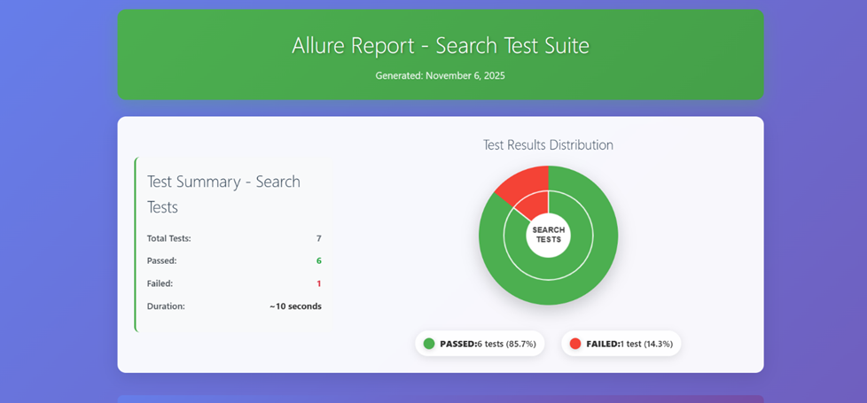
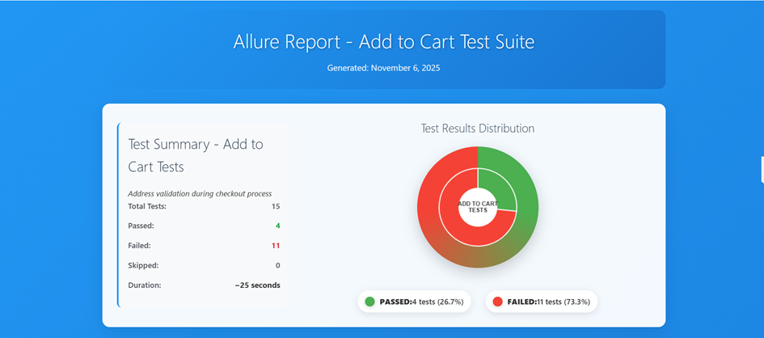

# Kiểm thử Tự động E2E Evershop

Khung kiểm thử tự động Evershop sử dụng Selenium WebDriver và TestNG, với báo cáo Allure riêng biệt cho các bộ kiểm thử khác nhau.

## 🚀 Bắt đầu Nhanh

### Yêu cầu Tiên quyết
- Java 17 hoặc cao hơn
- Maven 3.6+
- Trình duyệt Chrome/Firefox

### Cài đặt
```bash
git clone https://github.com/kim-anh-204/evershop-automation.git
cd evershop-automation
mvn clean compile
```

## 🧪 Chạy Kiểm thử

### Chạy Kiểm thử Tìm kiếm (7 trường hợp kiểm thử)
```bash
mvn test -Psearch
```
- Tạo: `target/allure-report-search/index.html`
- Phạm vi: Xác thực chức năng tìm kiếm sản phẩm

### Chạy Kiểm thử Thêm vào Giỏ hàng (15 trường hợp kiểm thử)
```bash
mvn test -Paddtocart
```
- Tạo: `target/allure-report-addtocart/index.html`
- Phạm vi: Xác thực địa chỉ và chức năng thanh toán

### Chạy Tất cả Kiểm thử
```bash
mvn test -Psearch && mvn test -Paddtocart
```

## 📊 Xem Báo cáo

### Báo cáo Mẫu (Có thể xem ngay sau khi sao chép)
- **Báo cáo Tìm kiếm Demo**: `docs/index.html` (chuyển hướng đến báo cáo tìm kiếm)
- **Báo cáo Thêm vào Giỏ hàng Demo**: `docs/allure-report-addtocart/index.html`

### Báo cáo Được Tạo (Sau khi chạy kiểm thử)
- Báo cáo Tìm kiếm: `target/allure-report-search/index.html` (7 trường hợp kiểm thử, 85.7% ĐẠT)
- Báo cáo Thêm vào Giỏ hàng: `target/allure-report-addtocart/index.html` (15 trường hợp kiểm thử, 26.7% ĐẠT)

Cả hai báo cáo đều có biểu đồ tròn tương tác, giao diện chuyên nghiệp và kết quả kiểm thử đầy đủ.





## 🎯 Tổng quan Bộ Kiểm thử

### 🔍 Bộ Kiểm thử Tìm kiếm
- **Số lượng Kiểm thử**: 7 phương thức
- **Phạm vi**:
  - Tìm kiếm theo tên sản phẩm chính xác
  - Tìm kiếm theo từ khóa
  - Tìm kiếm sản phẩm không tồn tại
  - Tìm kiếm với khoảng trắng
  - Tìm kiếm nhiều từ
  - Tìm kiếm đầu vào trống
  - Tìm kiếm một ký tự

### 🛒 Bộ Kiểm thử Thêm vào Giỏ hàng
- **Số lượng Kiểm thử**: 15 phương thức
- **Phạm vi**:
  - Xác thực biểu mẫu địa chỉ
  - Tạo địa chỉ thành công
  - Xác thực trường (tên, điện thoại, địa chỉ, thành phố, mã bưu điện)
  - Xác thực độ dài dữ liệu
  - Xác thực thông báo lỗi
  - Chỉnh sửa địa chỉ mặc định

## 🏗️ Cấu trúc Dự án

```
evershop-automation/
├── src/
│   ├── main/java/com/evershop/
│   │   ├── pages/          # Lớp Page Object
│   │   ├── testdata/       # Tiện ích dữ liệu kiểm thử
│   │   └── utils/          # Tiện ích trợ giúp
│   ├── test/java/com/evershop/
│   │   ├── tests/          # Lớp kiểm thử
│   │   └── utils/          # Tiện ích kiểm thử
│   └── test/resources/     # Cấu hình TestNG
├── target/                 # Tệp xây dựng (được tạo)
├── pom.xml                 # Cấu hình Maven
└── .gitignore
```

## 🛠️ Công nghệ Sử dụng

- **Selenium WebDriver 4.15.0** - Tự động hóa trình duyệt web
- **TestNG 7.8.0** - Khung kiểm thử
- **Allure 2.24.0** - Báo cáo kiểm thử với bộ riêng biệt
- **WebDriverManager 5.6.2** - Quản lý trình điều khiển trình duyệt
- **Maven Surefire Plugin** - Thực thi kiểm thử với hồ sơ
- **Lombok 1.18.32** - Tạo mã

## 📋 Hồ sơ Maven

### Hồ sơ: `search`
- Chạy: `SearchTests.java`
- Kết quả: `target/allure-results-search/`
- Báo cáo: `target/allure-report-search/`

### Hồ sơ: `addtocart`
- Chạy: `AddAddressTest.java`
- Kết quả: `target/allure-results-addtocart/`
- Báo cáo: `target/allure-report-addtocart/`

## 🎨 Tính năng Báo cáo

### Giao diện Chuyên nghiệp
- Nền gradient hiện đại
- Thiết kế đáp ứng cho tất cả thiết bị
- Biểu đồ tròn tương tác với hiệu ứng di chuột
- Mã màu trạng thái kiểm thử (xanh/đỏ)
- Kiểu chữ và khoảng cách sạch sẽ

### Biểu đồ Tương tác
- **Biểu đồ tròn dựa trên Canvas**
- **Hiển thị ĐẠT/THẤT thời gian thực**
- **Chú giải với số lượng và tỷ lệ phần trăm kiểm thử**
- **Hoạt hình và hiệu ứng gradient**

### Tóm tắt Kiểm thử
- Tổng số lượng kiểm thử
- Thống kê đạt/thất
- Thời gian thực thi
- Chỉ số mã màu

## 🚀 Sẵn sàng CI/CD

Dự án này được cấu hình cho đường ống CI/CD:

```bash
# Lệnh xây dựng và kiểm thử cho CI
mvn clean compile
mvn test -Psearch
mvn test -Paddtocart
```

## 📝 Đóng góp

1. Fork kho lưu trữ
2. Tạo nhánh tính năng (`git checkout -b feature/new-feature`)
3. Cam kết thay đổi (`git commit -m 'Thêm tính năng mới'`)
4. Đẩy đến nhánh (`git push origin feature/new-feature`)
5. Tạo Pull Request

## 📄 Giấy phép

Dự án này là phần mềm độc quyền - Tất cả Quyền được Bảo lưu.
